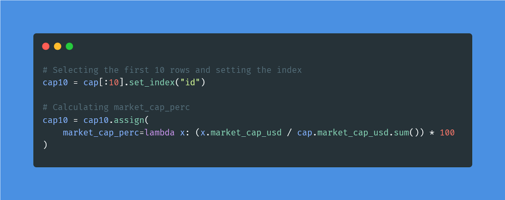
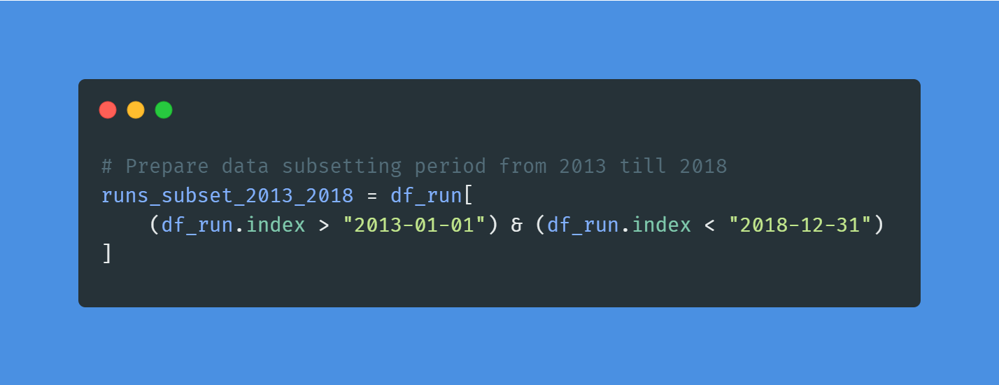
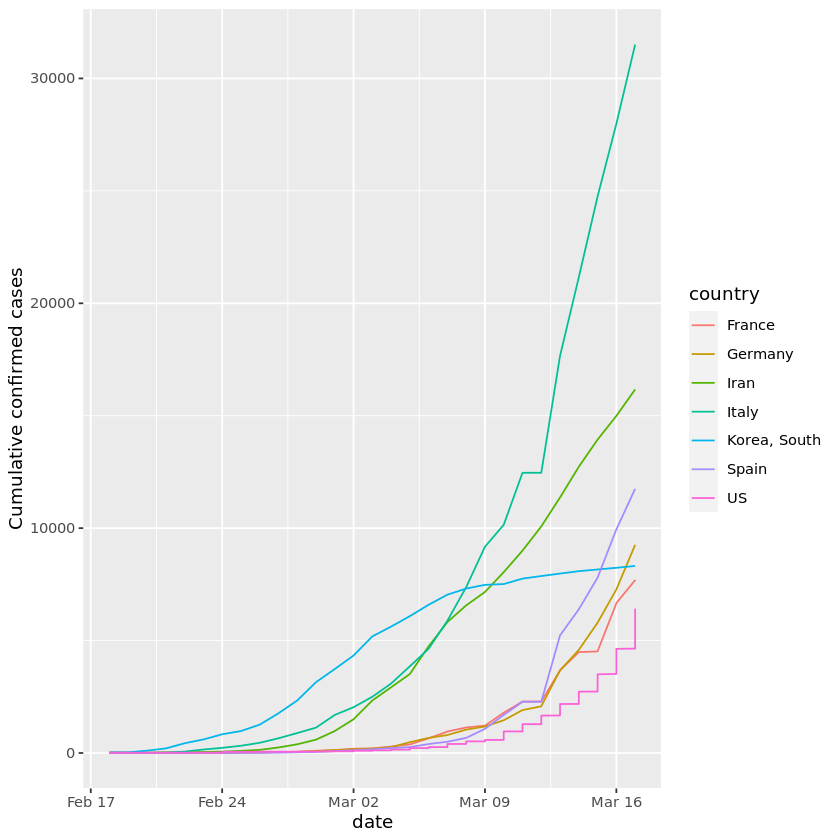

# Advanced Data Analytics Projects

For more advanced data analytics projects, you need command over mathematics, probability, and statistics. Furthermore, you will perform exploratory data and predictive analytics to understand the data in detail.

## Probability & Statistics Projects

### 1. Real-time Insights from Social Media Data

For the Real-time Insights from Social Media project, you will use various statistical tools to dive deep into Twitter’s hot trends. You will understand local and global patterns and common trends and perform frequency and language analysis.

**DataCamp Projects:** Real-time Insights from Social Media Data

You can apply similar methods used in the project on a new dataset: Internet News and Consumer Engagement, and learn more about analyzing news trends and consumer behavior.

### 2. Find Movie Similarities from Plot Summaries

In the Find Movie Similarity from Plot Summaries project, you will use NLP and clustering to find the similarities between movie plots. It is the perfect project if you are looking to apply statistical techniques to text data.

You will import two datasets, combine them, perform tokenization and stemming, convert words into vectors, and use KMeans to perform clustering. Furthermore, you will calculate similarity distance and visualize the results using Matplotlib, Linkage, and Dendrograms.

**DataCamp Projects:** Find Movie Similarity from Plot Summaries

Use your lessons from the project and apply them to a new dataset: Netflix Movie Data, to get experience applying statistics to text data.

## Exploratory Data Analysis (EDA) Projects

### 3. Analyze International Debt Statistics

In the Analyze International Debt Statistics project, you will write SQL queries to explore and analyze international debt using the World Bank dataset. SQL is the most popular and essential tool for performing data analytics on the go.

In the project, you will be finding the:

- Distinct countries
- Distinct debt indicators
- Total amount of debt owed by the countries
- Country with the highest debt
- Average amount of debt across indicators
- The highest amount of principal repayments
- The most common debt indicator

**DataCamp Projects:** Analyze International Debt Statistics

You will connect World Nations MariaDB dataset and apply similar queries to get additional experience in handling and analyzing SQL databases. Additionally, you can Exploratory Data Analysis in SQL course to advance techniques and queries in handling various SQL databases.

### 4. Investigating Netflix Movies and Guest Stars in The Office

In the Investigating Netflix Movies and Guest Stars in The Office project, you will use data manipulation and visualization to solve a real-world data science problem. You will perform deep exploratory data analysis and draw conclusions from detailed graphs.

**DataCamp Projects:** Investigating Netflix Movies and Guest Stars in The Office

You can work on a portfolio project by applying similar skills to a new dataset: Netflix Movie Data. Furthermore, you can take Exploratory Data Analysis in Python to learn more about data cleaning and validation, understand the relationship and distribution, and explore multivariate relationships.

## Predictive Analytics Projects

### 5. Functions for Food Price Forecasts

In the Functions for Food Price Forecasts project, you will perform predictive analysis of food prices in Rwanda. You will import, wrangle, manipulate, and forecast data using R packages. It is perfect for beginners and professionals who are getting started with the R language and predictive analysis.

**DataCamp Projects:** Functions for Food Price Forecasts

You can create a time-series forecast R function for Loan Data and get better at performing predictive analysis using R packages. Moreover, you can complete the Forecasting Product Demand in R course to learn more about forecasting demand with time series, blending regression, and hierarchical forecasting.

### 6. Predicting Credit Card Approvals

In the Predicting Credit Card Approvals project, you will build the best-performing machine learning model for predicting credit card application approvals.

First, you will understand the data and impute missing values. After that, you will preprocess the data and train a logistic regression model on the training set. In the end, you will evaluate the results and improve the model performance using Grid searching.

**DataCamp Project:** Predicting Credit Card Approvals

Applying simple machine learning algorithms is an essential part of a data analyst’s life. You can gain more experience by applying similar methods to a new dataset: Bank Marketing.

Learn more about classification, regression, fine-tuning, and preprocessing by taking a short Supervised Learning with the scikit-learn course.
